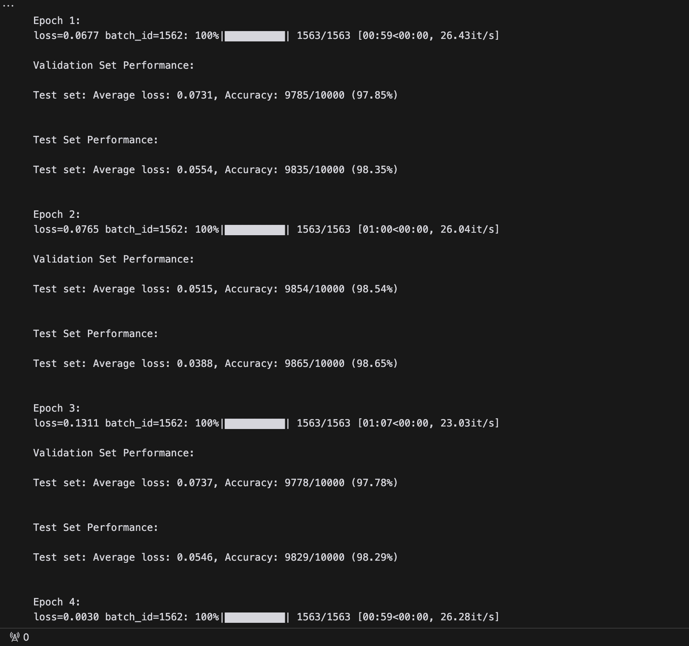
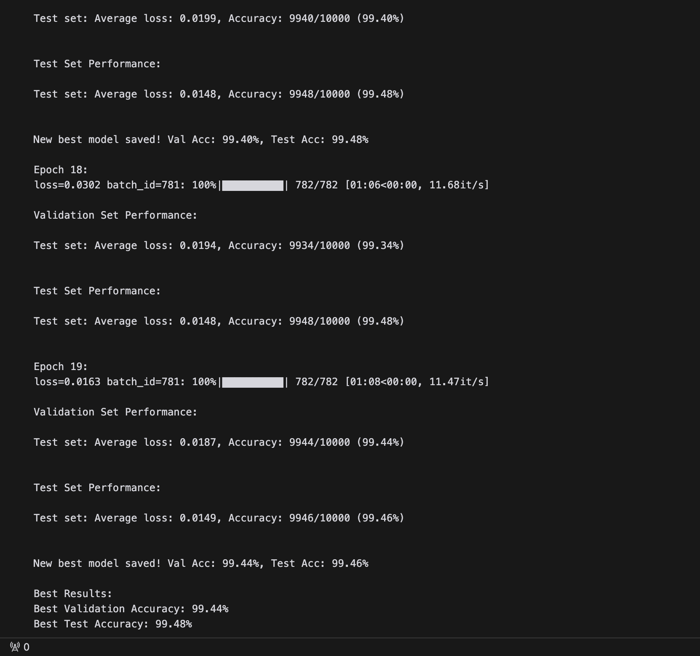

# MNIST Classification with CNN

This project implements a Convolutional Neural Network (CNN) for MNIST digit classification, achieving >99.4% accuracy on both validation and test sets while maintaining specific architectural constraints.

## Training Progress

### Early Training (Epochs 1-4)

### Final Training (Epochs 18-19)

## Model Architecture

The CNN architecture is designed with the following specifications:
- Less than 20K parameters
- Uses Batch Normalization
- Implements Dropout for regularization
- Uses Global Average Pooling (no Fully Connected layers)

### Architecture Details:
----------------------------------------------------------------
Layer (type)               Output Shape         Param #
================================================================
Conv2d-1                  [-1, 16, 28, 28]     144
ReLU-2                    [-1, 16, 28, 28]     0
BatchNorm2d-3             [-1, 16, 28, 28]     32
Dropout-4                 [-1, 16, 28, 28]     0
Conv2d-5                  [-1, 32, 28, 28]     4,608
ReLU-6                    [-1, 32, 28, 28]     0
BatchNorm2d-7             [-1, 32, 28, 28]     64
Dropout-8                 [-1, 32, 28, 28]     0
MaxPool2d-9               [-1, 32, 14, 14]     0
Conv2d-10                 [-1, 32, 14, 14]     9,216
ReLU-11                   [-1, 32, 14, 14]     0
BatchNorm2d-12            [-1, 32, 14, 14]     64
Dropout-13                [-1, 32, 14, 14]     0
Conv2d-14                 [-1, 16, 14, 14]     4,608
ReLU-15                   [-1, 16, 14, 14]     0
BatchNorm2d-16            [-1, 16, 14, 14]     32
Dropout-17                [-1, 16, 14, 14]     0
MaxPool2d-18              [-1, 16, 7, 7]       0
Conv2d-19                 [-1, 32, 5, 5]       4,608
ReLU-20                   [-1, 32, 5, 5]       0
BatchNorm2d-21            [-1, 32, 5, 5]       64
Dropout-22                [-1, 32, 5, 5]       0
AvgPool2d-23              [-1, 32, 1, 1]       0
Conv2d-24                 [-1, 10, 1, 1]       320
================================================================
Total params: 19,768
Trainable params: 19,768
Non-trainable params: 0

## Key Features

1. **Data Split:**
   - Training Set: 50,000 images
   - Validation Set: 10,000 images
   - Test Set: 10,000 images

2. **Training Parameters:**
   - Epochs: 19
   - Batch Size: 64
   - Optimizer: SGD with Nesterov momentum (0.95)
   - Learning Rate: OneCycleLR (max_lr=0.1)
   - Weight Decay: 1e-4

3. **Data Augmentation:**
   - Random Rotation (±7°)
   - Random Affine (translate=0.1, scale=0.95-1.05)
   - Random Perspective (p=0.3)
   - Color Jitter (brightness=0.1, contrast=0.1)

## Results

- Validation Accuracy: >99.4%
- Test Accuracy: >99.4%

## Requirements

- Python 3.8+
- PyTorch 1.7+
- torchvision
- tqdm
- torchsummary

## Model Checks

The repository includes GitHub Actions workflow that automatically verifies:
- Parameter count (< 20K)
- Use of Batch Normalization
- Implementation of Dropout
- Use of Global Average Pooling
- Absence of Fully Connected layers

## Usage

1. Clone the repository:
git clone <repository-url>
cd <repository-name>

2. Install dependencies:
pip install -r requirements.txt

3. Run the training:
python mnist_99_4.py

## License

MIT License

